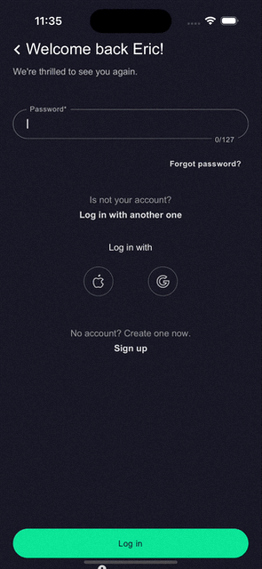
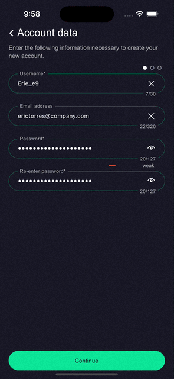
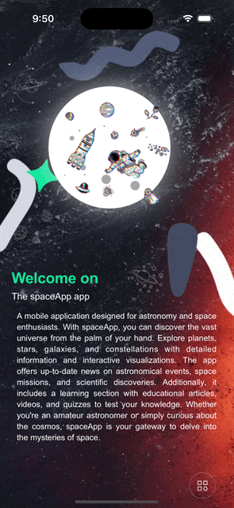
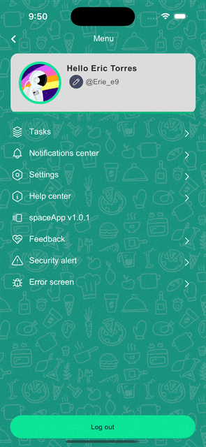
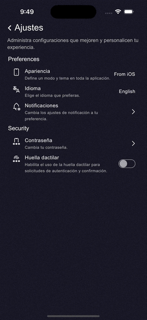
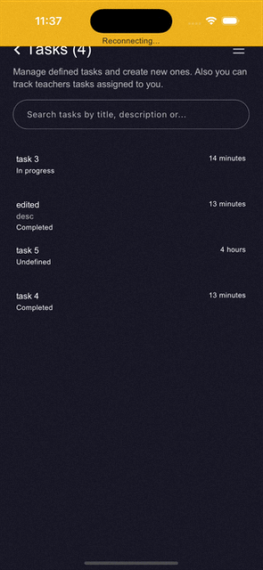
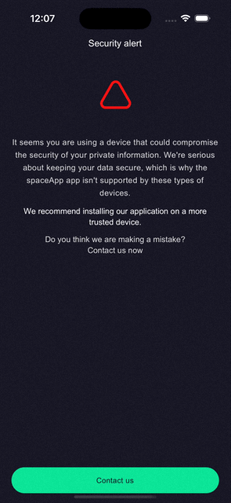
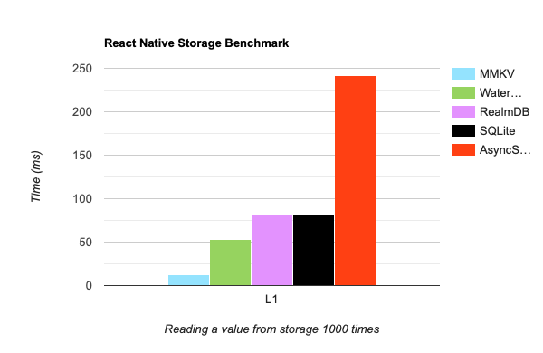

## 🚀 spaceApp | React Native Boilerplate

A modern, **state-of-the-art React Native + TypeScript boilerplate** crafted for performance, scalability, and maintainability. Pre-configured project setup that saves time. _(Note: Special flows are not included)_.

Powered by:


Hermes

### Key Features ✨

#### 🛠️ Core Architecture

- **New Architecture & Fabric**: Built on the latest React Native architecture for enhanced performance and flexibility.
- **Code Methodologies**: The codebase follows SOLID principles, Atomic Design, KISS, DRY, and Clean Code methodologies.
- **Redux Toolkit**: Efficient and maintainable state management.

#### 🗄️ User Experience (UX/UI)

- **Animated Splash Screen**: Beautifully animated splash screen using Lottie, with support for dark and light modes.
- **Multi-Theme Support**: Fully customizable themes, including light and dark modes.
- **Multi-Animated Backgrounds**: Dynamic and animated background styles.
- **Smooth UI Animations**: Leveraging Lottie and Reanimated for seamless animations.
- **SVG & WebP Support**: Enhanced image format support for rich visuals.
- **React-Native-Skia**: High-performance 2D graphics.
- **Multi-Step Form**: A reusable component with UI styles, supporting complex forms.

#### 🔥 Performance & Optimization Techniques

- **Image Caching**: Optimized image handling for improved performance using `react-native-fast-image`.
- **Offline Functionality**: Ensures a seamless user experience.
- **List Performance**: High-performance list handling for large datasets using `flash-list`.
- **Android Optimization**: Includes Proguard, tree shaking, split builds, and `useLegacyPackaging` for faster build times.
- **Nitro Modules and New Architecture-Based Libraries**: Preference for updated, smaller, and well-optimized packages.
- **Render Techniques**: Utilizes React hooks to optimize rendering and minimize re-renders.

#### 🔐 Security

- **SSL Pinning**: Establishes a secure link between a web server and the app, enabling an encrypted connection.
- **Device Trust Check**: Detects potentially hacked or untrusted devices, installed apps, or insecure environments.
- **Code Obfuscation**: Android Proguard obfuscates the code.
- **Encrypted Storage**: Provides secure and fast storage using `react-native-mmkv`.
- **Keychain Integration**: Implements Keychain on iOS devices for storing sensitive values securely.

#### 🧩 Additional Features

- **Multilingual Support (GE | EN | ES | FR | PO)**: Integrated with i18next for seamless localization; the app starts with the device's language.
- **Authentication**: Includes form-based authentication.
- **Social Media Authentication**: Simplified login via popular social media platforms.
- **In-App Web Viewer**: Embedded browser for enhanced user experience.
- **Custom Hooks & Components**: Built for maintainability and reusability.
- **Responsive UI Support**: Consistent experience across screen sizes.
- **API Integration with Queue and Retry actions**: Simplified network request implementation. It includes a better user experience with enqueue and retry API request features.
- **Firebase Remote Config**: Remotely enable or disable features using the Firebase console.
- **Biometrics**: Supports authentication and action confirmation via biometrics.

---

### Getting Started

#### Requirements

- Node.js 18+ and npm/yarn
- React Native CLI
- Xcode (for iOS development)
- Android Studio (for Android development)

#### Quick start

1. To create a new project using the boilerplate simply run:
   ```bash
   npx @react-native-community/cli@latest init MyApp --template @erie_e9/react-native-spaceApp
   ```
2. Install dependencies:
   ```bash
   yarn install
   ```
3. Run the project:
   - Start Metro:
     ```bash
     yarn start
     ```
   - Select platform:
     - iOS:
     ```bash
     yarn ios
     ```
     - Android:
     ```bash
     yarn android
     ```

---

### Project Structure

```plaintext
spaceApp/
├── src/
│   ├── assets/       # Static assets like images, svgs, fonts, etc.
│   ├── components/   # Reusable UI components (Atomic Design)
│   ├── hooks/        # Custom React hooks
│   ├── navigators/   # Navigation setup (React Navigation)
│   ├── redux/        # Slices and types for state management
│   ├── services/     # Firebase, utilities, language files, etc.
│   ├── theme/        # Theme definitions
│   ├── utils/        # Utility functions and helpers
│   └── App.tsx       # Main application entry point
├── android/          # Android-specific configuration
├── ios/              # iOS-specific configuration
└── package.json      # Project dependencies
```

---

### Demo

#### Authentication: Sign-In and Sign-Up

<div style="display: flex; justify-content: space-around;">
  
  
</div>

#### Home and Help (Report a Bug)

<div style="display: flex; justify-content: space-around;">
  
  
</div>

#### Menu and Preferences

<div style="display: flex; justify-content: space-around;">
  
  
</div>

#### CRUD: Tasks and Offline Features

<div style="display: flex; justify-content: space-around;">
  
  
</div>

#### Hacked Device Warning and Fallback Screen

<div style="display: flex; justify-content: space-around;">
  
  
</div>

### Storage packages comparation

## 

### TODO

- **Push Notifications**: Integrated push notifications for real-time updates.
- **Background fetch**: Updates meanwhile app is closed.
- **Performance**: Integrate react-compiler-runtime to provide a whole app helper with re-renders and app interaction.

### License

This project is licensed under the [MIT License](LICENSE).

---

### Acknowledgments

- ❤️ Built with love using React Native-CLI.
